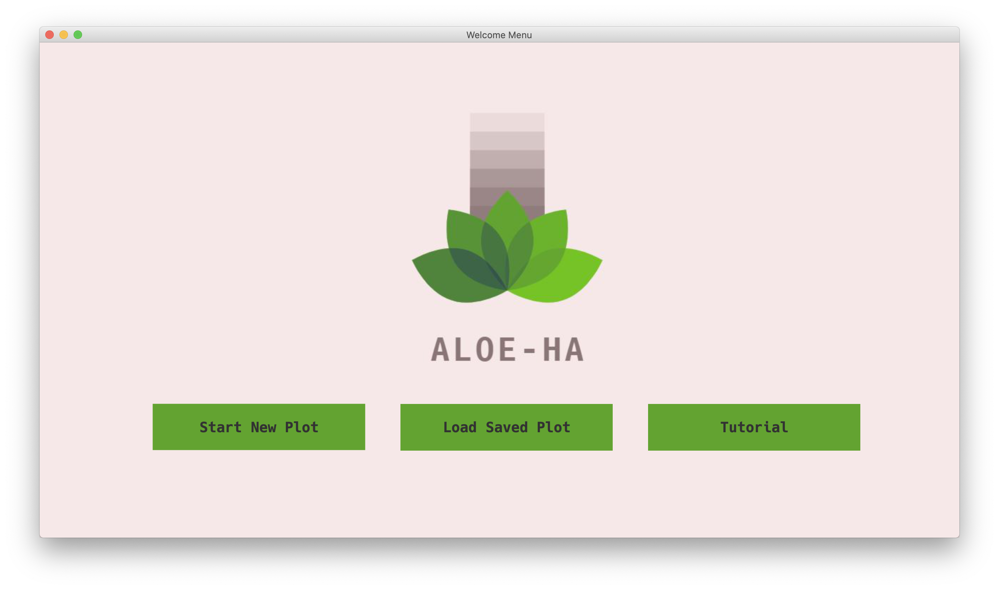
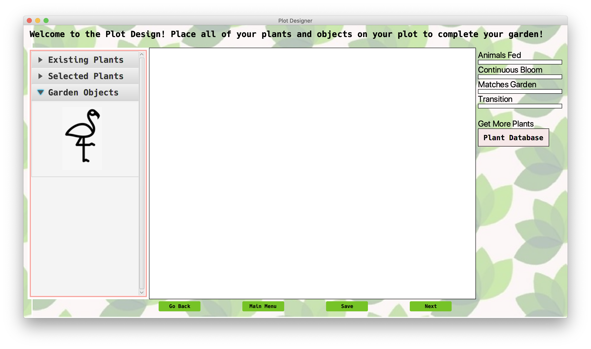
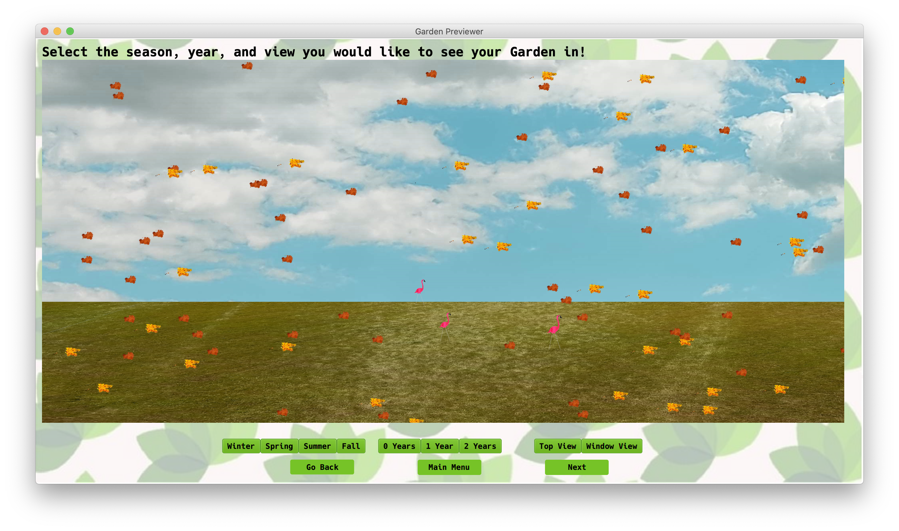

# cisc275-011-team-0

---

## Aloe-Ha: Garden Project

Welcome to your personal garden plot designer.

Built from the ground up to flexible, dynamic, and responsive, _Aloe-Ha_ is an open-source, light-weight, JavaFX application that works on any platform to help you design your dream garden.

Using sophisticated algorithms and rendering technology, you can design your plot with a collection of over **4,000 plants** to choose from. All plant was obtained from [public sources](docs/plant-data-sources.md).

Start your new plot, today!

## Downloads

The latest packaged jars can be found [in the release page](releases). You may need to [download and install Java 11 in order to run it](https://www.oracle.com/java/technologies/javase-jdk11-downloads.html). Simply double-clicking the jar should run it.

## Work and Documentation

The work that has been done for this project can be inspected in the [`docs` folder](docs/README.md).

### Team Members

From the [University of Delaware](http://www1.udel.edu/CIS/275/tharvey/20S/) CISC 275 course of Spring, 2020:

 - Jiamian Wang
 - Viva Laas
 - Megha Patel
 - Brett Wagner
 - James Villemarette
